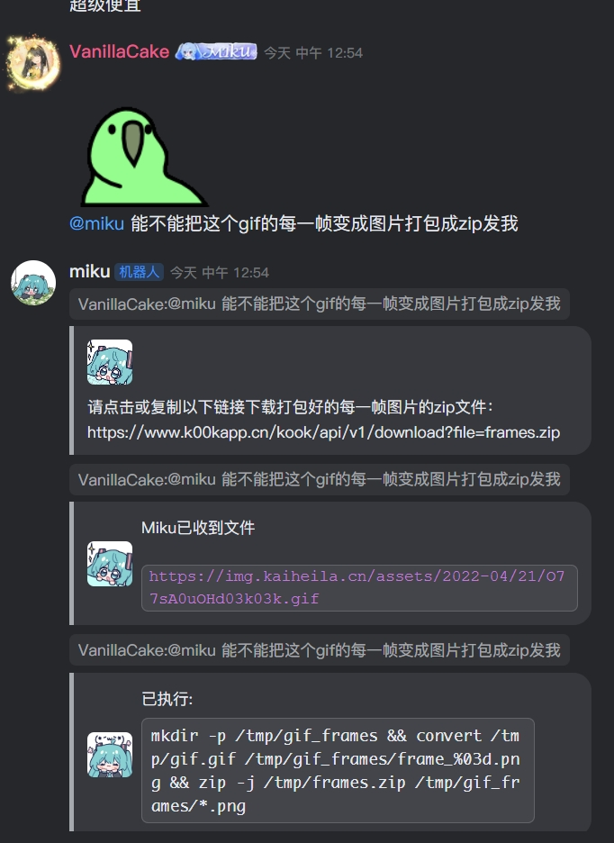
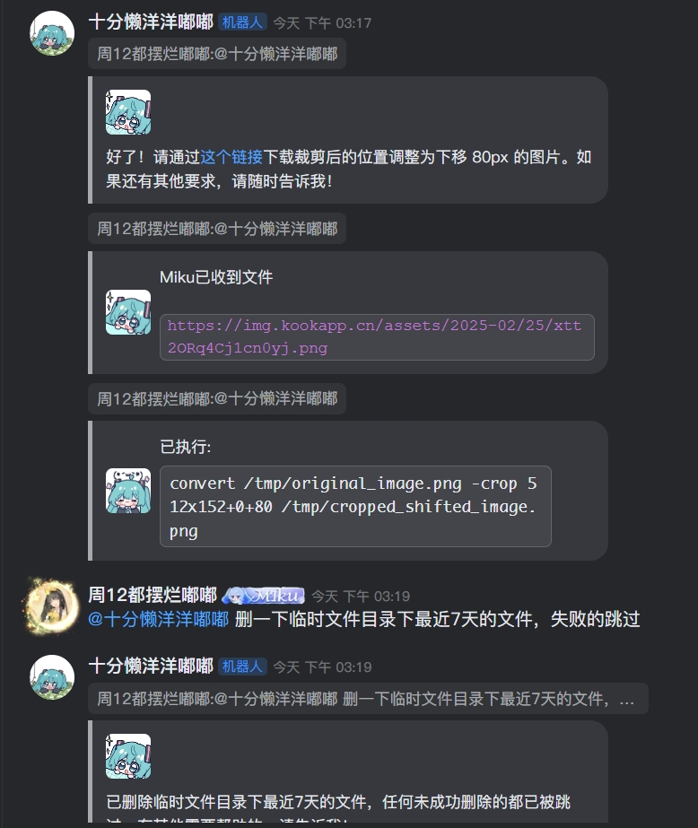
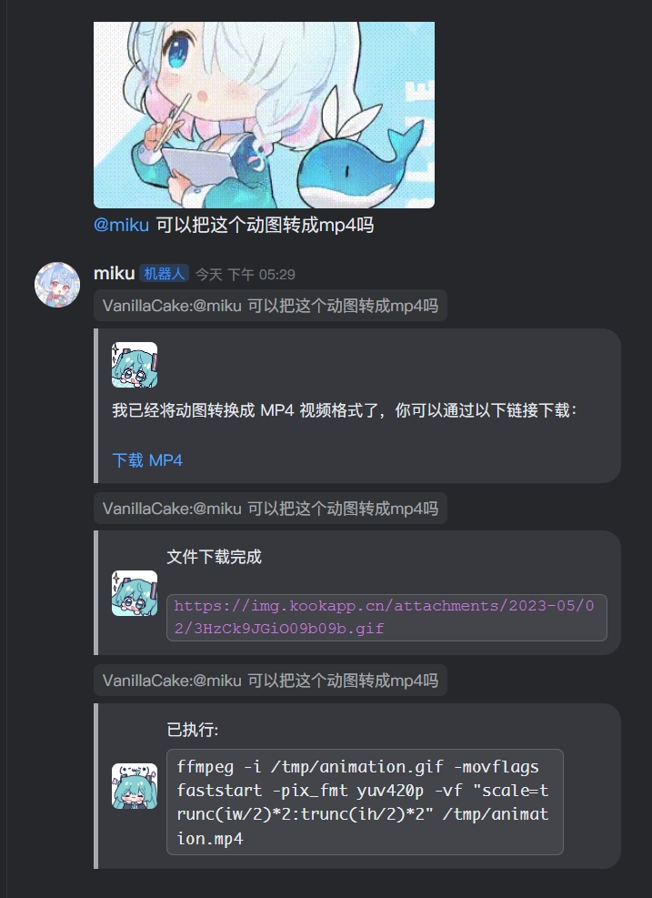
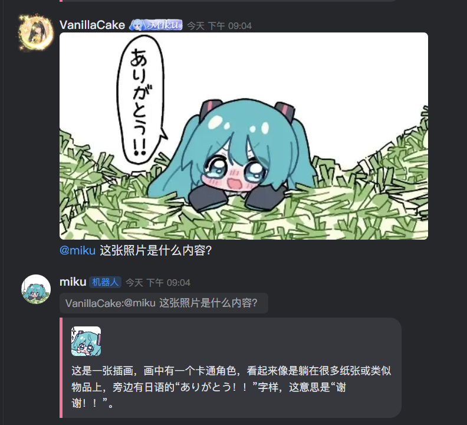
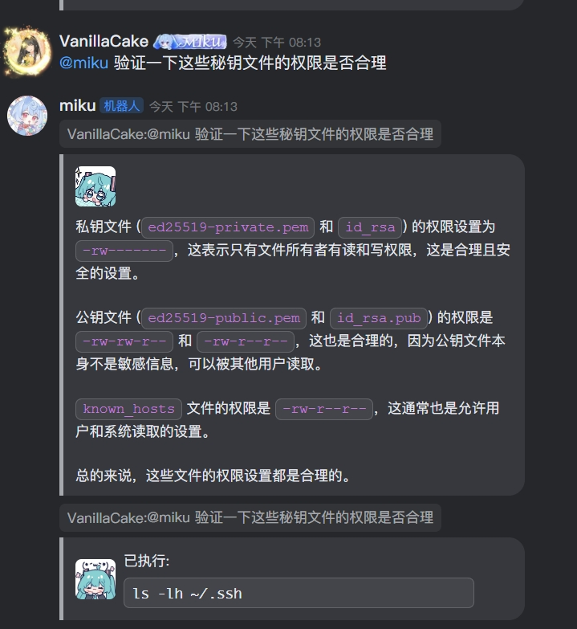

# Miku - KOOK 机器人

<p>
  
  
</p>

原本是一个 KOOK WebSocket 机器人的练习项目，如今已经可以满足日常使用需求~

Miku 机器人永远不会接入 OpenClaw，但如果你需要 OpenClaw，推荐 KOOK 官方 OpenClaw 频道实现：

- https://www.npmjs.com/package/@kookapp/openclaw-kook

## Usage

推荐使用 Bun 管理依赖与运行。

### 安装

```bash
bun install
```

### 运行

```bash
bun run start
```

### 配置模型

配置集中在根目录 `config.yaml`（本地私有）：

- 先复制 `config.yaml.example` 为 `config.yaml`
- 支持的 provider: `openai`、`google`、`anthropic`、`volcengine`
- 可通过 `chat.defaultModel` 设置默认模型（如 `MiniMax-M2.7@anthropic`）
- 可通过 `chat.disableCapabilities.vision` 全局禁用指定 provider 的视觉能力（未禁用默认开启）
- 每个 provider 可配置多个 `suppliers`（`baseUrl + apiKey + matches`）
- `matches` 基于 `String.includes`，用于按模型名路由 supplier
- 涉及 KOOK 开发/API 的问题会按需注入平台技能提示，并可调用 `kook_platform` 工具

切换模型命令（管理员）：

```bash
@机器人 /set-backend <model>@<provider>
```

其中 provider 来自 `chat.providers`，model 可以自由填写，不需要在配置里预登记，例如：

- `gpt-5.3@openai`
- `Claude-3-7-Sonnet@anthropic`
- `MiniMax-M2.7@anthropic`
- `deepseek-v3-1-250821@volcengine`

`@` 前面的模型名会原样透传；`@` 后面的 provider 会自动转小写。

显示思考过程开关（频道级，管理员）：

```bash
@机器人 /show-reasoning on
@机器人 /show-reasoning off
```

显示模型与 token 消耗开关（频道级，管理员）：

```bash
@机器人 /show-model-usage on
@机器人 /show-model-usage off
```

## 功能

- 群聊模式
- 动态切换 LLM、继承上下文
- ~~Stable Diffusion API~~ 画的什么玩意儿，已经去掉了
- 指令支持
- 插件 API（还没兼容 MCP）
- Yuki 系列 API
  - 测试工具、动态指令定义等

## 示例：简单任务







## 示例：视觉能力



## 示例：做做运维



---
